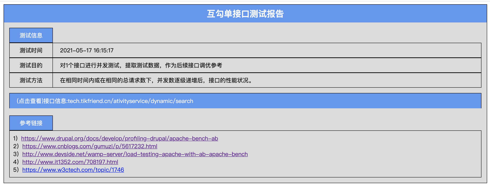

# Apache_BenchMark API Test Tool

### 一、前言

- 项目说明：本项目使用Apache_BenchMark(一下简称ab)测试工具，对<font color='red'>**单个**</font>接口进行压测，并输出测试结果。
- 最终效果：在表格中编写单接口压力测试用例，一键执行，逐次对表格内所有接口遍历执行，并输出测试报告。
- ab官网地址：http://httpd.apache.org/docs/2.0/programs/ab.html

### 二、环境

- python环境：python 3.6 
- IDE：PyCharm

### 三、安装和使用

#### 1、克隆本项目到本地

```bash
git clone https://github.com/Zekylly/ApacheBenchmarkAPITestTool
```

#### 2、工程目录说明


#### 3、根据自己的接口，填写测试用例表格`TestPlan.xls`

##### 3.1、表格的各字段说明

- **测试接口名称**：填写接口名称，可自定义

- **接口说明**：填写接口名称，可自定义，主要方便标记

- **测试接口地址**：全部地址，包含`协议`、`ip或域名`、`端口号`、`接口`。格式例如：http://www.baidu.com:8080/get/weather

- **Post数据文件地址**：若接口为get请求，该字段为放空。若接口为post接口，则需要传入post数据体，以`.json`形式存储，默认选取路径为`项目/JsonFile/xxxx.json`

  ```json
  {"pageNumber":1,"pageSize": 1,"type":1}
  ```

- **头文件类型(选填)**：即提交数据方式（enctype 属性），规定在发送到服务器之前应该如何对表单数据进行编码。

  | 值                                | 描述                                                         |
  | --------------------------------- | ------------------------------------------------------------ |
  | application/x-www-form-urlencoded | 在发送前编码所有字符（默认）                                 |
  | multipart/form-data               | 不对字符编码。在使用包含文件上传控件的表单时，必须使用该值。 |
  | application/json                  | 作为请求头告诉服务端**消息主体是序列化的JSON字符串**。除低版本的IE，基本都支持。 |
  | text/plain                        | 空格转换为 “+” 加号，但不对特殊字符编码。                    |

- **头文件参数**：token等相关参数填写处。

- **测试时长(秒)**：与**测试次数**二选一，表示多用户并发测试持续时长

- **测试次数(请求总数)**：与**测试时长**二选一，表示多用户并发测试的总次数

- **并发数级别(|隔开)**：设置vu并发数，直接填写并发用户数，例如：10，表示程序将创建10个虚拟用户。若需要测10、20、50、100、1000个并发用户，则只需使用”|“隔开即可，例：10|20|50|100|1000

- **是否保持用户连接(-k,选填,默认否)**：Use HTTP KeepAlive feature。将http请求保持长连接，该配置可能会影响性能结果数据

- **日志级别(1~4,选填,默认为1)**：测试过程中的日志级别。1为默认，最少日志量，4为最高，最多日志量

- **间隔时长(不同并发的间隔时间，单位：秒)**：单多个并发数级别时，或有多个单接口串联测试时，为避免每次的测试互相干扰，设置每次测试完成后，该测试工具将time.sleep()的方式来等待服务器”降温“。

##### 3.2、get 请求

需保证测试用例表格中”**测试接口地址的**“的准确性，同时”**Post数据文件地址**“字段放空

##### 3.3、post 请求

2.3.1、编写`.json`文件放置目录：`项目/JsonFile/xxxx.json`，其余参考测试用例表格中”**Post数据文件地址**“


#### 4、执行测试

编写完成工程表格用例后，进入工程目录，执行main.py，执行过程中，查看PyCharm的Console输出栏，将输出执行日志。


#### 5、查看结果

打开./ReportFile目录下的测试报告，并使用浏览器打开，即可查看。

##### 5.1整体报告




##### 5.2测试命令及Post数据


##### 5.3关键数据结果


#### 6、注意事项

- 为避免接口报错而无法知晓，编写计划调试时，请先试用日志级别3进行测试，测试完成后，在`./ResultFloder/`目录下找到对应的测试结果，打开查看是否得到了正确的服务器Response。
- 测试报告中所有数据，均取自在工程各目录下各文件
- 尽量使用`.xls`格式文件编写TestPlan
- 该项目当前仅可测单接口，多接口数据参数化串联测试暂未实现
- 本项目依赖于ab工具测试结果，更多知识及参数请参考：
  - https://www.drupal.org/docs/develop/profiling-drupal/apache-bench-ab
  - https://www.cnblogs.com/gumuzi/p/5617232.html
  - http://www.devside.net/wamp-server/load-testing-apache-with-ab-apache-bench
  - http://www.it1352.com/708197.html
  - https://www.w3ctech.com/topic/1746


